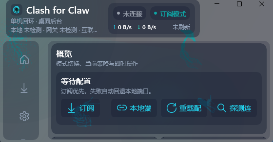

# Clash for Claw

<div align="center">
  

  <p><strong>面向 OpenClaw / Claw 链路的本地桌面控制端。</strong></p>
  <p><strong>更聚焦、更紧凑、更安静，只处理真正和本机代理入口有关的事情。</strong></p>

  <p>
    <a href="https://github.com/KeyanHu-git/Clash-for-Claw/stargazers">
      
    </a>
    <a href="https://github.com/KeyanHu-git/Clash-for-Claw/releases">
      
    </a>
    
    
  </p>
</div>

<p align="center">
  
</p>

## 项目缘起

这个项目并不是从“我要做一个桌面代理软件”开始的，而是从一个很具体的问题开始的。

笔者是在 **Windows 环境** 里，通过 **Docker 镜像** 安装和运行 Claw。实际使用时发现：

- 如果不开宿主机的全局 VPN 模式
- Claw 本身就很难稳定出网
- 于是很多能力虽然已经部署好了，但实际并不能顺畅使用

因此，这个项目最初首先解决的是一个非常现实的问题：

- 让 Claw 在 Windows + Docker 的实际环境里，能够稳定、自动、长期地联网

也正因为这个出发点，`Clash for Claw` 的核心从来都不是“做一个前端界面”，而是：

- 为 Claw 准备一条可靠的本地代理链路
- 让这条链路可以被注册为 Windows 后台服务
- 让 Claw 在前台界面关闭、托盘图标不显示的情况下，依然能够自动联网

前端界面其实是后面才补上的。

之所以补这个前端，不是因为后台能力离不开它，而是因为很多朋友并不熟悉命令行、服务管理和本地代理配置。对于这些用户来说，一个可视化、中文化、状态清楚、能看见配置结果的界面，会明显更安心，也更容易真正用起来。

## 项目定位

`Clash for Claw` 不是一个泛代理配置面板，而是一套专门围绕 `OpenClaw / Claw + Adapter` 链路设计的本地桌面控制端。

它更强调下面几件事：

- 只关心本机回环链路
- 只暴露真正有用的状态、切换与配置
- 尽量少按钮、少打扰、少层级
- 前台负责可视化，后台负责稳定驻留
- 保持中文友好与日常可维护性

换句话说，它的目标不是“什么都做”，而是把和 Claw 最相关的这一条链路，做得足够顺手、足够稳定、足够像一个产品。

## 亮点

### 1. 为 Claw 使用场景而设计

这个项目从一开始就不是通用桌面代理壳，而是直接围绕下面这条工作流来组织：

- OpenClaw / Claw 需要一个明确的本地代理入口
- Adapter 需要一个清楚、稳定、可观察的前台
- 用户需要尽量少的概念切换

所以它把重点放在：

- 订阅与本地端口两种核心模式
- 回环、网关、互联网三段状态观察
- 后台驻留与无感运行
- 最少但够用的可视化配置

### 2. 默认不打扰用户

项目遵循的是“配置在前台，运行在后台”的思路：

- 可使用桌面后台模式
- 可最小化到托盘
- 可开机自启
- 可静默启动
- 可切换到服务模式
- 服务失败时可降级到计划任务

### 3. 只把关键状态讲清楚

界面不是做成“大而全的控制台”，而是集中在几个真正重要的信息上：

- 当前模式
- 当前连通状态
- 网关是否可达
- 互联网是否正常
- 订阅是否可用
- 当前流量速率与更新时间

### 4. 更适合长期放在自己电脑上用

它的目标不是一次性演示，而是作为本机长期存在的一部分：

- 设置持久化
- 敏感值不回显
- 本地日志落盘
- 后端可按需自动拉起
- UI 和后台职责分离

## 当前已实现能力

- WinUI 3 中文桌面界面
- 概览 / 订阅 / 设置 / 日志与高级 / 说明 五个主页面
- 网关地址与令牌配置
- URL 中 token 自动解析但不回显
- 订阅模式与本地端口模式切换
- 订阅缺失时自动回退本地端口
- 本地服务、网关、互联网状态探测
- 订阅列表、单条刷新、全量刷新、导入、本地删除等基础交互
- 上下行速率与更新时间显示
- 设置持久化到本机配置文件
- 托盘、开机自启、静默启动、关闭最小化到托盘
- 调起 `OpenClaw-Adapter.exe --daemon`
- 服务模式启停与计划任务降级逻辑
- 程序化动态背景与数学水母背景

## 适合谁

- 正在使用 OpenClaw / Claw，希望把代理入口收拢到本地桌面端的人
- 希望代理控制界面尽量简单、稳定、长期可用的人
- 不想在日常使用里看到大量无关配置项的人

## 如何用到自己的电脑上

### 你需要准备什么

当前仓库主要提供 **WinUI 前端**。

真正负责本地 API、订阅处理、Mihomo 子进程、后台模式的，是配套的：

- `OpenClaw-Adapter.exe`

也就是说：

- 本仓库负责桌面界面
- `OpenClaw-Adapter.exe` 负责后台能力

### 方式一：从源码运行

#### 1. 准备环境

- Windows 10 2004+ 或 Windows 11
- .NET 10 SDK
- WinUI 3 / Windows App SDK 开发环境
- 一份可运行的 `OpenClaw-Adapter.exe`

#### 2. 克隆仓库

```powershell
git clone https://github.com/KeyanHu-git/Clash-for-Claw.git
cd Clash-for-Claw
```

#### 3. 准备后端

把 `OpenClaw-Adapter.exe` 放到以下任一位置：

- 与本项目生成后的 `OpenClawAdapter.exe` 同目录
- 在“设置”页里手动指定 CLI 路径

#### 4. 构建

```powershell
dotnet build OpenClawAdapter.csproj -p:Platform=x64
```

#### 5. 启动

```powershell
.\bin\x64\Debug\net10.0-windows10.0.19041.0\win-x64\OpenClawAdapter.exe
```

### 首次配置建议

1. 在“概览”页确认后台已经启动
2. 填写网关地址与令牌
3. 去“订阅”页添加订阅 URL
4. 先把订阅模式跑通
5. 确认稳定后再启用开机自启、静默启动或服务模式

## 本地文件位置

- 界面设置：`%AppData%\OpenClawAdapter\settings.json`
- 服务模式数据目录：`%ProgramData%\OpenClawAdapter`
- 服务模式日志：`%ProgramData%\OpenClawAdapter\logs\adapter.log`

## 首个公开版本

当前仓库已开始使用独立版本号发布。

首个公开预览版本为：

- `v0.1.0`

你可以在这里查看后续发布：

- https://github.com/KeyanHu-git/Clash-for-Claw/releases

## 开源协议

本项目当前采用 **MIT License**。

这意味着你可以：

- 个人使用
- 商业使用
- 修改与再分发

你需要保留：

- 原始版权声明
- 许可证文本

如果后续你希望改成更严格或更明确的协议，我可以继续替你调整。

## 安全提醒

- 不要把真实订阅 URL、真实 token、真实网关令牌提交到仓库
- README、截图、示例配置只应使用占位符
- 即使界面支持从 URL 自动提取 token，也不代表这些 URL 适合进入 Git 历史

## 如果这个项目对你有帮助

欢迎给仓库点一个 Star：

- https://github.com/KeyanHu-git/Clash-for-Claw

这会直接帮助这个项目继续往下做：

- 更稳定的服务模式
- 更成熟的发布与分发
- 更完整的订阅体验
- 更统一的品牌、图标与视觉细节

## 致谢

### 数学水母动态背景

本项目背景灵感与可视化参考来源于和鲸社区转载内容，使用时应标注来源：

- 作者：Shelter / MrIShelter
- 标题：一起赛博摸鱼呀——数学公式下的生命构型与动态
- 时间：2025/08/04
- 来源：https://www.heywhale.com/mw/project/687e3f38c678037e34ebf61e
