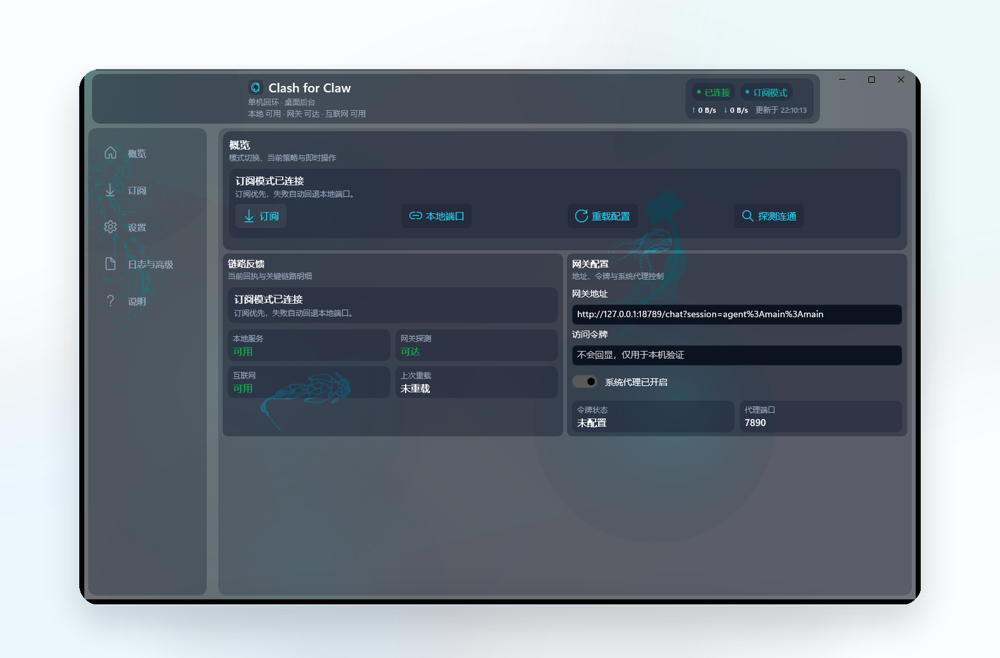

# Clash for Claw

<div align="center">
  

  <p><strong>面向 OpenClaw / Claw 的 Windows 桌面代理控制端</strong></p>
  <p>把 mihomo / Clash 订阅接入、本地端口接入、Windows 服务模式和链路状态收进一个可直接安装的桌面程序。</p>
  <p><strong>Windows desktop proxy control panel for OpenClaw / Claw, with mihomo subscription mode, local port mode, Windows service mode, and seamless failover switching.</strong></p>

  <p>
    <a href="https://github.com/KeyanHu-git/Clash-for-Claw/releases">
      
    </a>
    
    <a href="https://github.com/KeyanHu-git/Clash-for-Claw/stargazers">
      
    </a>
  </p>
</div>

<p align="center">
  
</p>

## 发布形态

- 正式发布物为安装版 `Clash-for-Claw-x.y.z-setup.exe`
- 安装包默认包含桌面端、后台服务组件与 `mihomo.exe`
- 正常使用不需要额外下载运行时或手动拼装文件夹

当前公开版本：[`v0.1.1`](https://github.com/KeyanHu-git/Clash-for-Claw/releases/tag/v0.1.1)

## 核心能力

- `OpenClaw / Claw` 本地代理接入
- `mihomo / Clash` 订阅模式
- `本地端口` 模式
- `Windows 服务模式`
- `多订阅自动探测` 与 `无感切换`

## 项目定位

`Clash for Claw` 不是 OpenClaw 的替代品，也不修改 OpenClaw 本地仓库。它负责 Windows 这一层本地控制面，把代理入口、后台驻留、服务模式和链路状态集中到独立程序中。

这个项目主要解决四件事：

- 在 `订阅模式` 和 `本地端口模式` 之间做统一切换
- 提供稳定的桌面后台与 `Windows 服务模式`
- 用一个页面查看本地服务、网关和外网状态
- 在多订阅场景下实现更稳的自动探测与无感切换

## 接入前需要准备

第一次接入通常只需要 3 项内容：

1. `OpenClaw 网关地址`
   本机默认可先试 `http://127.0.0.1:18789`

2. `OpenClaw 访问令牌`
   对应 OpenClaw 的 `gateway.auth.token`

3. `代理入口`
   二选一即可：
   - `订阅模式`：一条支持 `Clash` / `Mihomo` 的订阅 URL
   - `本地端口模式`：本机已有代理入口时，填写本地端口，默认 `7890`

## 这些内容从哪里获取

### OpenClaw 网关地址

- 本机一般直接填写 `http://127.0.0.1:18789`
- 如需确认，可执行 `openclaw dashboard --no-open`

### OpenClaw 访问令牌

- 可执行 `openclaw config get gateway.auth.token`
- 或直接查看 OpenClaw 配置中的 `gateway.auth.token`

如果拿到的是 `http://127.0.0.1:18789/#token=...` 这类完整链接，不要整串粘贴到同一个输入框中。应拆开填写：

- `网关地址`：`http://127.0.0.1:18789`
- `访问令牌`：`#token=` 后面的那段 token

### 订阅 URL

订阅通常来自代理服务提供方后台的 `Clash` / `Mihomo` 导入入口。本项目不提供订阅，也不内置节点。

接入前建议至少确认：

- 提供的是标准 `Clash` / `Mihomo` 订阅链接
- 流量额度、有效期和节点地区符合实际需求
- 订阅更新策略明确
- 售后方式、规则说明和风险提示清晰

## 快速开始

1. 下载并安装 `Clash-for-Claw-x.y.z-setup.exe`
2. 启动 OpenClaw 网关
3. 打开 `Clash for Claw`
4. 在首页填写 `网关地址` 和 `访问令牌`
5. 在“订阅”页导入订阅 URL，或在“设置”页填写本地端口
6. 回到首页，确认 `本地服务 / 网关 / 外网` 三项状态正常

## 运行模式

### 订阅模式

- 软件内置 `mihomo.exe`
- 探测流量与正式流量分离
- 候选订阅会在独立 shadow runtime 中探测
- 正式链路只在最终选定后切换一次，避免探测阶段反复扰动真实流量

### 本地端口模式

- 适合本机已有代理入口的场景
- 软件只负责接入 OpenClaw，不接管第三方代理本体

### Windows 服务模式

- 可在软件内直接注册与启动
- 通常需要管理员权限
- 注册失败时会明确提示，不会静默伪装成服务模式
- 启用后即使前台窗口关闭，后台仍可继续运行

## 数据目录与日志

默认数据目录分为两处：

- 桌面模式：`%AppData%\ClashForClaw`
- 服务模式：`%ProgramData%\ClashForClaw`

这样做是为了让升级、覆盖安装或移动程序目录时，运行数据、配置和日志不会跟着安装目录一起丢失。

日志相关行为如下：

- 桌面日志目录可在软件“日志”页中手动选择
- 软件会记住上次设置的桌面日志目录
- 服务模式日志固定写入服务目录，便于排障
- 日志仅保存在本机

## 设计约束

- 不修改 OpenClaw 本地仓库
- 不依赖 OpenClaw 的目录结构或更新节奏
- 默认只监听 `127.0.0.1`
- 不把整机网络出口强制重写为系统全局代理

需要注意：

- 在 Docker Desktop 环境中，`host.docker.internal` 仍可能访问宿主机 loopback 端口，因此这不是物理隔离
- 若当前网络无法访问 GitHub，也可手动将 `mihomo.exe` 放入程序目录下的 `bin` 中

## 构建

```powershell
git clone https://github.com/KeyanHu-git/Clash-for-Claw.git
cd Clash-for-Claw
dotnet build ClashForClaw.csproj -p:Platform=x64
```

生成默认发布包：

```powershell
powershell -NoProfile -ExecutionPolicy Bypass -File .\scripts\build-release-matrix.ps1 -Version 0.1.1
```

单独生成安装版：

```powershell
powershell -NoProfile -ExecutionPolicy Bypass -File .\scripts\build-installer.ps1 -Version 0.1.1
```

## 协议

本项目采用 [MIT License](LICENSE)。
